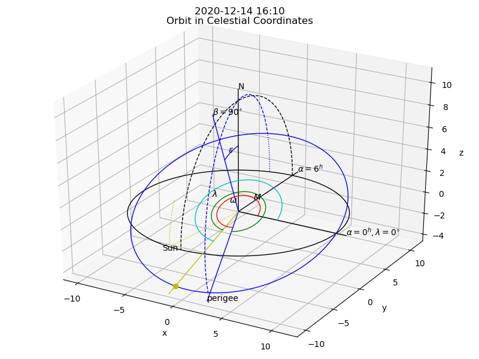

.. Astronomy documentation master file, created by
   sphinx-quickstart on Sat Oct 26 09:26:43 2019.
   You can adapt this file completely to your liking, but it should at least
   contain the root `toctree` directive.

Single Dish Radio Astronomy Software Tools
==========================================

For an overview of SDRAST and the current status please visit https://sdrast.github.io/.

.. automodapi:: Astronomy

.. raw:: html

  

.. automodapi:: Astronomy.solar

+-----------------+-------------------------------------+
|                 |Slowly Varying                       |
+=================+=====================================+
|:math:`\omega`   | ecliptic longitude of the perigee   |
+-----------------+-------------------------------------+
|:math:`\epsilon` | obliquity of the eclipstic          |
+-----------------+-------------------------------------+

+-----------------+-------------------------------------+
|                 | Annually Varying                    |
+=================+=====================================+
|:math:`\alpha`   | right ascension                     |
+-----------------+-------------------------------------+
|:math:`\delta`   | declination                         |
+-----------------+-------------------------------------+
|:math:`M`        | ecliptic longitude of the Sun       |
+-----------------+-------------------------------------+
|:math:`\lambda`  | Sun's anomaly                       |
+-----------------+-------------------------------------+

+------------+-------------------------------------------------+
|            | Projected on Sky toward Sun                     |
+============+=================================================+
|:math:`P`   | tilt of the ecliptic w.r.t. equator             |
+------------+-------------------------------------------------+
|            | tilt of the Sun w.r.t. ecliptic                 |
+------------+-------------------------------------------------+
|:math:`L_0` | longitude of the solar disk center              |
+------------+-------------------------------------------------+
|:math:`B_0` | latitude of the solar disk center               |
+------------+-------------------------------------------------+

.. automodapi:: Astronomy.orbits3D

.. raw:: html

  

  
.. automodapi:: Astronomy.coordconv

.. raw:: html

  

.. automodapi:: Astronomy.DSN_coordinates

.. raw:: html

  

.. automodapi:: Astronomy.Ephem

.. raw:: html

  

.. automodapi:: Astronomy.formats

.. raw:: html

  

.. automodapi:: Astronomy.northpolar

.. raw:: html

  

.. automodapi:: Astronomy.redshift

.. raw:: html

  

.. automodapi:: Astronomy.ATCA_caldb

.. raw:: html

  

.. automodapi:: Astronomy.TAI

.. raw:: html

  

.. automodapi:: Astronomy.SIMBAD

.. toctree::
   :maxdepth: 2

Indices and tables
==================

* :ref:`genindex`
* :ref:`modindex`
* :ref:`search`
